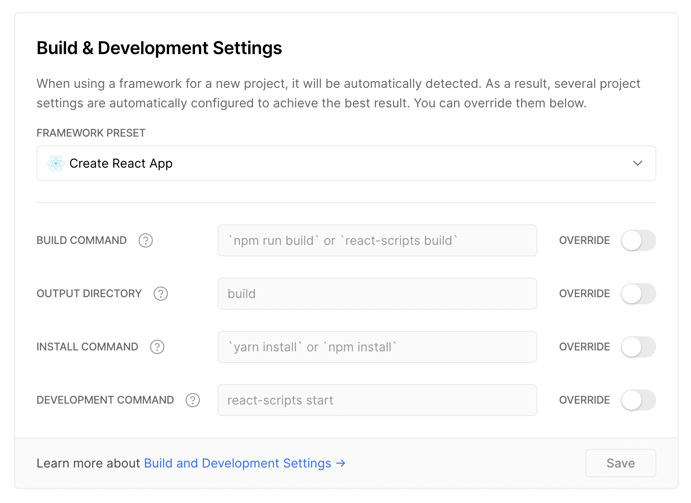

# hashdrop

## Getting started

Download dependencies and:

```
npm install
```

Make sure `vercel` is installed globally, and you've logged in via `vercel login`.

Pull environment variables from vercel:

```
vercel env pull
```

[More on env variables in CRA](https://create-react-app.dev/docs/adding-custom-environment-variables/#what-other-env-files-can-be-used)

Note: the `env` vars like `process.env.PINATA_API_KEY` are populated from:
https://vercel.com/markmiro/hashdrop/settings/environment-variables

Run:

```
npm start
```

The above runs `vercel dev` which should run `react-scripts start`. More on this here: https://vercel.com/docs/build-step#build-&-development-settings.


https://vercel.com/markmiro/hashdrop/settings/general
